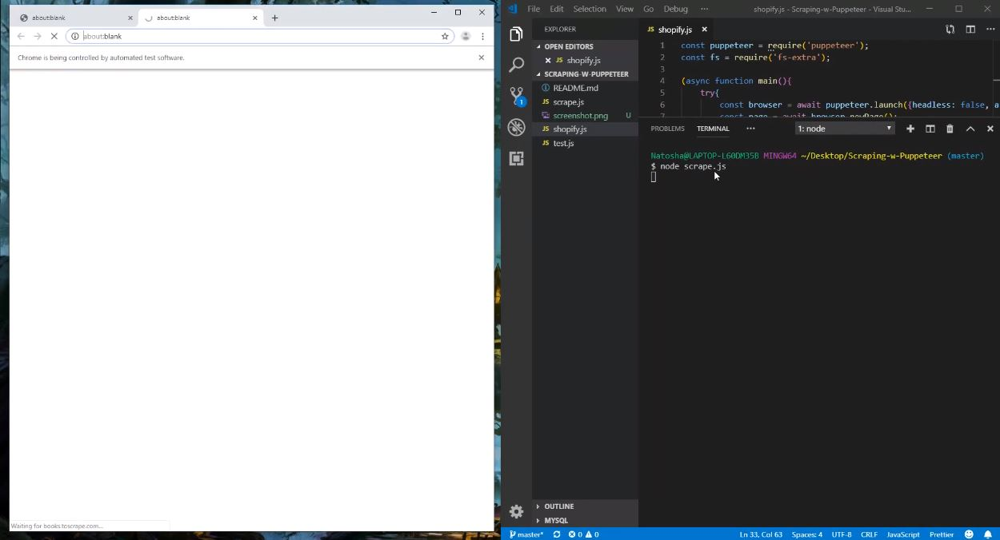

# Scraping-w-Puppeteer
Just some scraping with Puppeteer. 
Click on thumbnail to watch scrape

# Why? 

Scraping is a great tool for data collection and input consolidation.

# Installation 

npm install fs-extra

npm i puppeteer

# Usage
Please read the documentation for usage

https://github.com/jprichardson/node-fs-extra

https://www.npmjs.com/package/puppeteer

# Credit

Followed along with these tutorials

https://www.youtube.com/watch?v=IvaJ5n5xFqU

https://codeburst.io/a-guide-to-automating-scraping-the-web-with-javascript-chrome-puppeteer-node-js-b18efb9e9921
